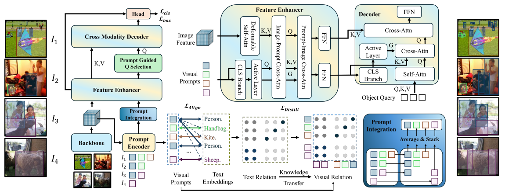

# [(ICLR 2026) DETR-ViP: Detection Transformer with Robust Discriminative Visual Prompts](https://arxiv.org/pdf/2604.14684)

## Introduction

DETR-ViP is a detection framework for **visual prompted object detection**, an interactive paradigm that uses visual features — rather than text — to define target categories on the fly. While visual prompts excel at recognizing rare and fine-grained categories, existing methods suffer from poor class discriminability because they treat visual prompts as a byproduct of text-prompted training.

DETR-ViP addresses this with three key innovations:
- **Global Prompt Integration** — incorporates global class relationships into visual prompt learning
- **Visual-Textual Prompt Relation Distillation** — transfers discriminability from text to visual prompts via knowledge distillation
- **Selective Fusion Strategy** — stably combines visual and textual prompts for robust detection

Built on image-text contrastive learning, DETR-ViP achieves substantial improvements on COCO, LVIS, ODinW, and Roboflow100 for both zero-shot generic and interactive detection.

This repository contains the official implementation of DETR-ViP-T and DETR-ViP-L.



## Results

### Zero-shot Generic Detection (COCO & LVIS)

<table border="1" cellpadding="6" style="border-collapse: collapse; text-align: center; margin: 0 auto;">
  <thead>
    <tr>
      <th rowspan="2">Model</th>
      <th rowspan="2">Pretrain</th>
      <th>COCO</th>
      <th colspan="4">LVIS</th>
      <th>ODinW</th>
      <th>RF100</th>
    </tr>
    <tr>
      <th>AP</th>
      <th>AP</th>
      <th>AP<sub>f</sub></th>
      <th>AP<sub>c</sub></th>
      <th>AP<sub>r</sub></th>
      <th>AP<sub>avg</sub></th>
      <th>AP<sub>avg</sub></th>
    </tr>
  </thead>
  <tbody>
    <tr>
      <td><a href="configs/detr_vip/DETR-ViP_swin-t_pretrain_obj365_goldg.py">DETR-ViP-T</a></td>
      <td>O365</td>
      <td>42.3</td>
      <td>41.1</td>
      <td>40.4</td>
      <td>43.3</td>
      <td>35.1</td>
      <td>65.4</td>
      <td>66.1</td>
    </tr>
    <tr>
      <td><a href="configs/detr_vip/DETR-ViP_swin-l_pretrain_obj365_goldg.py">DETR-ViP-L</a></td>
      <td>GoldG</td>
      <td>52.4</td>
      <td>43.5</td>
      <td>42.3</td>
      <td>45.1</td>
      <td>42.9</td>
      <td>—</td>
      <td>64.2</td>
    </tr>
  </tbody>
</table>

### Zero-shot Interactive Detection (COCO & LVIS)

<table border="1" cellpadding="6" style="border-collapse: collapse; text-align: center; margin: 0 auto;">
  <thead>
    <tr>
      <th rowspan="2">Model</th>
      <th>COCO</th>
      <th colspan="4">LVIS</th>
      <th>ODinW</th>
      <th>RF100</th>
    </tr>
    <tr>
      <th>AP</th>
      <th>AP</th>
      <th>AP<sub>f</sub></th>
      <th>AP<sub>c</sub></th>
      <th>AP<sub>r</sub></th>
      <th>AP<sub>avg</sub></th>
      <th>AP<sub>avg</sub></th>
    </tr>
  </thead>
  <tbody>
    <tr>
      <td><a href="configs/detr_vip/DETR-ViP_swin-t_pretrain_obj365_goldg.py">DETR-ViP-T</a></td>
      <td>65.4</td>
      <td>66.1</td>
      <td>57.5</td>
      <td>73.5</td>
      <td>78.4</td>
      <td>46.8</td>
      <td>40.1</td>
    </tr>
    <tr>
      <td><a href="configs/detr_vip/DETR-ViP_swin-l_pretrain_obj365_goldg.py">DETR-ViP-L</a></td>
      <td>71.1</td>
      <td>71.9</td>
      <td>64.2</td>
      <td>78.2</td>
      <td>83.6</td>
      <td>51.2</td>
      <td>44.3</td>
    </tr>
  </tbody>
</table>

## Installation

### Requirements

| Package | Version |
|---------|---------|
| PyTorch | 2.0.1+cu117 |
| torchaudio | 2.0.2+cu117 |
| torchvision | 0.15.2+cu117 |
| MMCV | 2.1.0 |
| MMDetection | 3.3.0 |
| MMEngine | 0.11.0rc2 |
| numpy | 1.26.4 |
| spacy | 2.3.9 |

### MMCV

Online installation: refer to the [MMCV installation guide](https://github.com/open-mmlab/mmcv/blob/main/docs/zh_cn/get_started/installation.md).

Offline installation:
```bash
cd third_party
git clone https://github.com/open-mmlab/mmcv.git
pip install -e . -v
```

### MMDetection

Online installation: refer to the [MMDetection installation guide](https://github.com/open-mmlab/mmdetection/blob/main/docs/zh_cn/get_started.md).

Offline installation:
```bash
cd third_party
git clone https://github.com/open-mmlab/mmdetection.git
pip install -e . -v
```

### MMEngine

Online installation: refer to the [MMEngine installation guide](https://github.com/open-mmlab/mmengine/blob/main/docs/zh_cn/get_started/installation.md).

Offline installation:
```bash
cd third_party
git clone https://github.com/open-mmlab/mmengine.git
pip install -e . -v
```


## Data Preparation

### Pretrained Models

**Swin Transformer backbones** (auto-downloaded by default; offline fallback):

| Model | Download Link |
|-------|---------------|
| Swin-Tiny | [swin_tiny_patch4_window7_224.pth](https://github.com/SwinTransformer/storage/releases/download/v1.0.0/swin_tiny_patch4_window7_224.pth) |
| Swin-Large | [swin_large_patch4_window12_384_22k.pth](https://github.com/SwinTransformer/storage/releases/download/v1.0.0/swin_large_patch4_window12_384_22k.pth) |

If offline, download the above and place them under `~/.cache/torch/hub/checkpoints/`.

**CLIP model** (for generating category feature caches):  
Download from [clip-vit-base-patch32](https://huggingface.co/openai/clip-vit-base-patch32/tree/main) and set the path as `path_clip_weights` in the commands below.

### DETR-ViP-T Pretraining Data

DETR-ViP-T is pretrained on **Objects365 V1** and **GoldG** datasets. Configs for training on COCO or Objects365 alone are also provided.

#### 1. Objects365 V1

Corresponding config: [DETR-ViP_swin-t_pretrain_obj365.py](configs/detr_vip/DETR-ViP_swin-t_pretrain_obj365.py)

Objects365 V1 can be downloaded from [opendatalab](https://opendatalab.com/OpenDataLab/Objects365_v1). Both CLI and SDK download methods are supported.

After downloading and extracting, place or symlink it to `data/objects365v1` with the following structure:

```text
DETR-ViP
├── configs
├── data
│   ├── objects365v1
│   │   ├── objects365_train.json
│   │   ├── objects365_val.json
│   │   ├── train
│   │   │   ├── xxx.jpg
│   │   │   ├── ...
│   │   ├── val
│   │   │   ├── xxxx.jpg
│   │   │   ├── ...
│   │   ├── test
```

Convert to ODVG format using [coco2odvg.py](tools/dataset_converters/coco2odvg.py):

```shell
python -m tools.dataset_converters.coco2odvg data/objects365v1/objects365_train.json -d o365v1
```

After conversion, `o365v1_train_od.json` and `o365v1_label_map.json` will be created under `data/objects365v1`:

```text
DETR-ViP
├── configs
├── data
│   ├── objects365v1
│   │   ├── objects365_train.json
│   │   ├── objects365_val.json
│   │   ├── objects365_train_od.json
│   │   ├── o365v1_label_map.json
│   │   ├── train
│   │   │   ├── xxx.jpg
│   │   │   ├── ...
│   │   ├── val
│   │   │   ├── xxxx.jpg
│   │   │   ├── ...
│   │   ├── test
```

Generate the CLIP feature cache for Objects365 category names (required for [prepare_OD_cache.py](tools/data_prepare/prepare_OD_cache.py)):

```shell
python -m tools.data_prepare.prepare_OD_cache data/objects365v1/objects365_train.json --clip-path <path_clip_weights> --output cache/vocabulary/o365_vocabulary.pkl
```

#### 2. GoldG

The GoldG dataset consists of **GQA** and **Flickr30k**, originally from the MixedGrounding dataset in the GLIP paper (excluding COCO).

First, download the annotation files from [mdetr_annotations](https://huggingface.co/GLIPModel/GLIP/tree/main/mdetr_annotations). The required files are:
- `final_mixed_train_no_coco.json`
- `final_flickr_separateGT_train.json`

**GQA images** can be downloaded from [here](https://nlp.stanford.edu/data/gqa/images.zip). After downloading and extracting, place or symlink to `data/gqa`:

```text
DETR-ViP
├── configs
├── data
│   ├── gqa
│   │   ├── final_mixed_train_no_coco.json
│   │   ├── images
│   │   │   ├── xxx.jpg
│   │   │   ├── ...
```

**Flickr30k images** can be downloaded from [here](http://shannon.cs.illinois.edu/DenotationGraph/), which requires an application for access. After downloading and extracting, place or symlink to `data/flickr30k_entities`:

```text
DETR-ViP
├── configs
├── data
│   ├── flickr30k_entities
│   │   ├── final_flickr_separateGT_train.json
│   │   ├── flickr30k_images
│   │   │   ├── xxx.jpg
│   │   │   ├── ...
```

Convert GQA annotations to ODVG format using [goldg2odvg.py](tools/dataset_converters/goldg2odvg.py):

```shell
python -m tools.dataset_converters.goldg2odvg data/gqa/final_mixed_train_no_coco.json
```

After conversion, `final_mixed_train_no_coco_vg.json` will be created under `data/gqa`:

```text
DETR-ViP
├── configs
├── data
│   ├── gqa
│   │   ├── final_mixed_train_no_coco.json
│   │   ├── final_mixed_train_no_coco_vg.json
│   │   ├── images
│   │   │   ├── xxx.jpg
│   │   │   ├── ...
```

Convert Flickr30k annotations to ODVG format:

```shell
python -m tools.dataset_converters.goldg2odvg data/flickr30k_entities/final_flickr_separateGT_train.json
```

After conversion, `final_flickr_separateGT_train_vg.json` will be created under `data/flickr30k_entities`:

```text
DETR-ViP
├── configs
├── data
│   ├── flickr30k_entities
│   │   ├── final_flickr_separateGT_train.json
│   │   ├── final_flickr_separateGT_train_vg.json
│   │   ├── flickr30k_images
│   │   │   ├── xxx.jpg
│   │   │   ├── ...
```

Generate GoldG cache file using [prepare_OG_cache.py](tools/data_prepare/prepare_OG_cache.py):

```shell
python -m tools.data_prepare.prepare_OG_cache --clip-path <path_clip_weights> --gqa-path <gqa_json> --flickr-path <flickr_json> --save-path <save_path>
```
Example:

```shell
python -m tools.data_prepare.prepare_OG_cache --clip-path weights/clip-vit-base-patch32 --gqa-path data/GQA/final_mixed_train_no_coco_vg.json --flickr-path data/flickr/final_flickr_separateGT_train_vg.json --save-path cache/vocabulary/grounding
```

#### 3. COCO 2017

The above configs evaluate on COCO 2017 during training, so the dataset needs to be prepared. Download from the [COCO website](https://cocodataset.org/) or [opendatalab](https://opendatalab.com/OpenDataLab/COCO_2017). Place or symlink to `data/coco`.

Generate the COCO category CLIP feature cache (required for text detection evaluation):

```shell
python -m tools.data_prepare.prepare_OD_cache data/coco/annotations/instances_train2017.json --clip-path <path_clip_weights> --output cache/vocabulary/coco_text_cache.pkl
```

Sample the support set for Visual-G prompt detection using [support_dataset.py](tools/data_prepare/support_dataset.py):

```shell
python -m tools.data_prepare.support_dataset data/coco/annotations/instances_train2017.json -o cache/support/coco_sub.json
```

### DETR-ViP-T Evaluation Data

> **Note:** The evaluation content below has not been re-verified and may be updated in the future.

#### LVIS

Sample the support set for Visual-G prompt detection on LVIS:

```shell
python -m tools.data_prepare.support_dataset data/lvis/annotations/lvis_v1_train.json -o cache/support/lvis_sup.json --minival data/lvis/annotations/lvis_v1_minival.json
```


## Train

### Single GPU

```shell
python -m tools.train <config> --work-dir <work_dirs>
```

Example:
```shell
python -m tools.train configs/detr_vip/DETR-ViP_swin-t_pretrain_obj365.py --work-dir work_dirs/debug
```

### Multi-node Multi-GPU

> **Note:** Before running, set `path-to-project` to your project root path in [tools/dist_train.sh](tools/dist_train.sh).

```shell
bash tools/dist_train.sh <config> <GPUs> --work-dir <work_dirs>
```

Example:
```shell
bash tools/dist_train.sh configs/detr_vip/DETR-ViP_swin-t_pretrain_obj365.py 4 --work-dir work_dirs/debug
```

### VS Code Debug

Configure `.vscode/launch.json`:

```json
{
    "name": "train",
    "cwd": "${workspaceFolder}",
    "type": "python",
    "request": "launch",
    "program": "${workspaceFolder}/tools/train.py",
    "console": "integratedTerminal",
    "env": {
        "PYTHONPATH": "${workspaceFolder}"
    },
    "args": [
        "configs/detr_vip/DETR-ViP_swin-t_pretrain_obj365.py",
        "--work-dir", "work_dirs/debug"
    ],
    "justMyCode": false
}
```

## Evaluation

### Single GPU

```shell
python -m tools.test <config> <checkpoint> --work-dir <work_dirs>
```

### Multi-GPU

> **Note:** Before running, set `path-to-project` to your project root path in [tools/dist_test.sh](tools/dist_test.sh).

```shell
bash tools/dist_test.sh <config> <checkpoint> <work_dirs> <GPUs>
```

## Model Zoo

Due to company confidentiality requirements, pretrained weights cannot be released at this time. We will consider open-sourcing them once permitted.

## Citation

If any parts of our paper and code help your research, please consider citing us and giving a star to our repository.

```bibtex
@article{qian2026detr,
  title={DETR-ViP: Detection Transformer with Robust Discriminative Visual Prompts},
  author={Qian, Bo and Shi, Dahu and Wei, Xing},
  journal={arXiv preprint arXiv:2604.14684},
  year={2026}
}
```